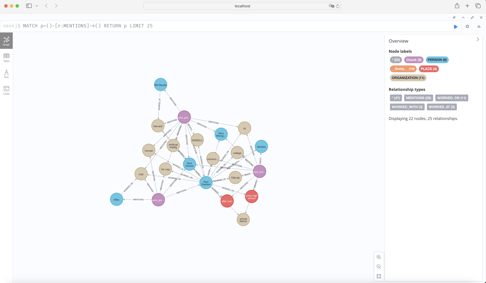

```markdown
# Knowledge Graphs with Azure OpenAI

This notebook demonstrates how to use Neo4j and Azure OpenAI to build a property graph. The example uses the `SchemaLLMPathExtractor` to specify an exact schema containing possible entity types, relation types, and defining how they can be connected together.

## Installation

To run this notebook, you need to install the following Python packages:

```bash
pip install llama-index
pip install llama-index-llms-ollama
pip install llama-index-embeddings-huggingface
pip install llama-index-graph-stores-neo4j
pip install openai
pip install llama-index-embeddings-azure-openai
pip install llama-index-llms-azure-openai
```

## Data Loading

The notebook loads data from a Paul Graham essay. Ensure you have the necessary data by running:

```python
!mkdir -p './azdev/paulgraham'
!curl -o 'https://raw.githubusercontent.com/run-llama/llama_index/main/docs/docs/examples/data/paul_graham/paul_graham_essay.txt' -O 'data/paul_graham/paul_graham_essay.txt'
```

## Graph Construction

The notebook constructs a property graph using the `SchemaLLMPathExtractor`. This extractor allows us to define a schema for our graph, ensuring the entities and relations follow a predefined structure.

### Example Schema

Entities:
- PERSON
- PLACE
- ORGANIZATION

Relations:
- HAS
- PART_OF
- WORKED_ON
- WORKED_WITH
- WORKED_AT

## Neo4j Setup

To launch Neo4j locally, ensure Docker is installed and run:

```bash
docker run \
    -p 7474:7474 -p 7687:7687 \
    -v $PWD/data:/data -v $PWD/plugins:/plugins \
    --name neo4j-apoc \
    -e NEO4J_apoc_export_file_enabled=true \
    -e NEO4J_apoc_import_file_enabled=true \
    -e NEO4J_apoc_import_file_use__neo4j__config=true \
    -e NEO4J_AUTH=neo4j/database4591 \
    -e NEO4JLABS_PLUGINS=\["apoc"\] \
    neo4j:latest
```

Access the database at [http://localhost:7474/](http://localhost:7474/). Use the default username/password `neo4j`/`neo4j` and change the password upon first login.

## Azure OpenAI Setup

Set your Azure OpenAI environment variables:

```python
import os

os.environ["AZURE_OPENAI_API_KEY"] = "<your-api-key>"
os.environ["AZURE_OPENAI_ENDPOINT"] = "<your-azure-endpoint>"
```

## Graph Index Creation

Initialize the `PropertyGraphIndex` using the schema, documents, and Azure OpenAI embeddings.

## Querying the Graph

With the created graph, you can perform queries using `LLMSynonymRetriever` and `VectorContextRetriever`.

## Conclusion

This notebook demonstrates the integration of Neo4j, Azure OpenAI, and `llama_index` to construct and query a knowledge graph. The resulting graph includes entities and relations following the predefined schema.

For more information on `kg_extractors`, refer to the [documentation](../../module_guides/indexing/lpg_index_guide.md#construction).
```

## Screenshots



## License

[Specify the license under which your project is licensed. If you're not sure, you can use the MIT license as a starting point.]

## Contributions

[Provide guidelines on how others can contribute to your project, if applicable.]

## Contact

[Provide your contact information, if you want others to be able to reach out to you.]

